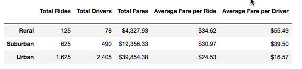

# PyBer_Analysis
## Challenge
### Pyber Average Fares for City Types
The purpose of this analysis on the data frame is to see how the average fare per ride and average fare per driver compared across the three different city types. We were able to take away the pieces of our data frame that we didn’t need and compiled the information that was useful to use in three rows that were indexed by the city type. As you can see in the data frame, the most revenue is coming from the urban environment despite the rural community having a higher per ride and driver fare. You can see from the graph that during the first quarter you can see that revenue increased in the urban and suburban areas while the revenue stayed about the same for the rural area. The volume generated by the urban areas far outlays the more money generated by individuals rides in the suburban and rural ares.

1{}(analysis/PyBer_Challenge.png)
	Some of the biggest challenges I had in this analysis was being able to isolate the individual drivers from each city. Since the driver count was given every time for every city, the sum function would not produce accurate data. The way I resolved the issue was to use the mean function for the cities. Once I had the cities number of drivers isolated I could count them in order to put our accurate averages in the data frame.
	One piece of actionable data I believe would be hire more drivers for the suburban and rural ares. This would help bring down your average fare per driver that would make it look more like your highest earning urban area. I think one other step you could go would be seeing what time of day you are generating the most fares. You would have another line chart broken up in 4 hour segments of the day to see what times of the days you would need the additional drivers working. You could use the resample function for figure out what time of day each ride occurred and some of the fares and plot it in a line chart.
